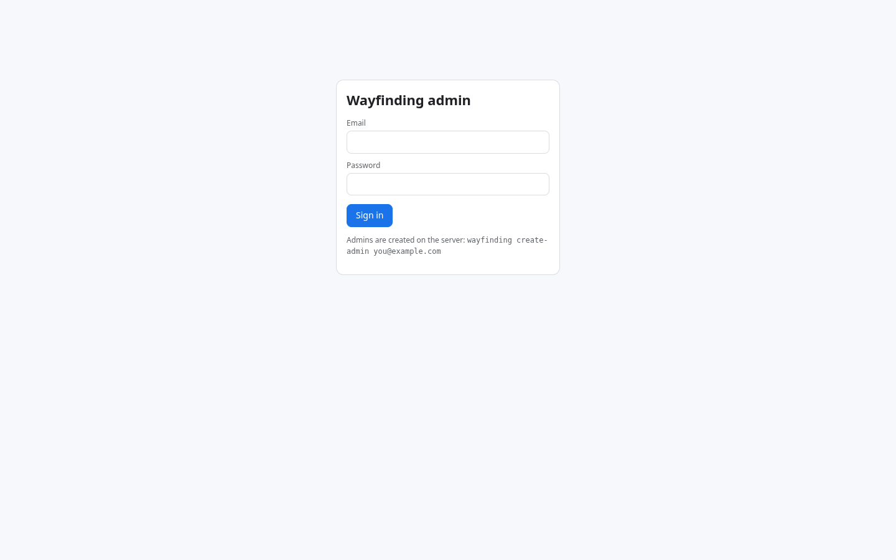
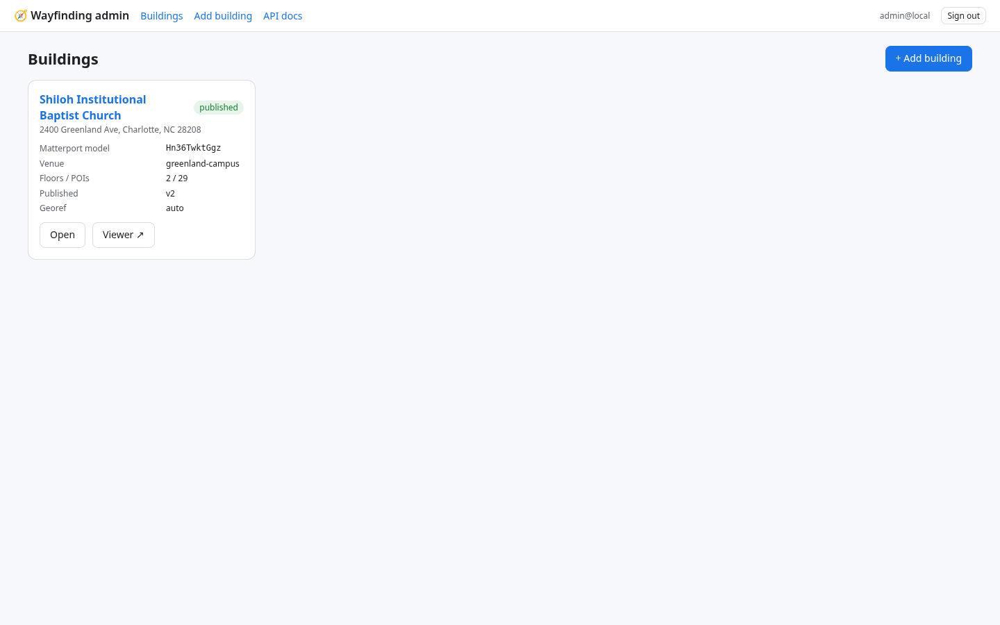
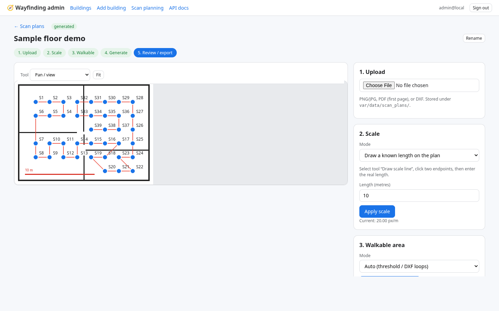

# Admin guide

URL: `https://<domain>/admin/` (dev: `http://127.0.0.1:8780/admin/`). Admin accounts are created on the server only:
`wayfinding create-admin you@example.com` (Docker: `docker compose exec api wayfinding create-admin …`). Tokens last `JWT_EXPIRE_MINUTES` (12 h).

| Page | What you can do |
|---|---|
| **Login**  | email + password (bcrypt) |
| **Dashboard** | Platform **Debug mode** toggle (global) + live log tail (timestamp, level, source, building, message). Filter by level/building; Clear; Export. Route: `#/dashboard`. Clients (platform viewer, mobile, Tour/mesh, localize, AR) ship verbose logs when effective debug is on. |
| **Config** | Platform runtime settings (Config Option 2). Editable non-secrets: chat LLM flags/URL/model/rate, geocoder, max upload, public URL, CORS, VPS URL (SSRF-aware). Secrets (LLM key, Matterport, JWT, DB, Variant): **configured yes/no** only; optional write-only set/clear — never echoed. Status: chat, LLM probe, VPS, Matterport key, public URL. Saves `var/runtime_settings.json` (+ `var/runtime_secrets.env` 0600). CORS/JWT/DB may need `scripts/dev_server.sh restart`. Route: `#/config`. Own-cloud: [`OWN_CLOUD.md`](OWN_CLOUD.md). |
| **Buildings**  | status badges (new / processing / ready / failed / published), open, open viewer |
| **Add building** | 4-step wizard: paste Matterport model id or Showcase URL → **Fetch from Matterport** fills name, floors/sweeps/rooms, address + lat/lon (geocodes street-like names when Matterport withholds geo) → review details → MatterPak/E57 → run. See ONBOARDING_A_MATTERPAK.md |
| **Overview** | model facts, SDK key status, georef summary, building settings (name, venue, address, brand colour, icon, **Enabled languages** checkboxes → `branding.enabled_languages`, pipeline options JSON; elevators are easier on the Elevators tab), pipeline controls (run all / from step / single step, force), right-hand **map block** with view modes **2D / 3D / Satellite / Digital twin** (Showcase; **defaults to Digital twin** when a Matterport model id is set) + georef preview |
| **Georeference** | **Align 3D model to satellite**: floor-plan overlay in one map block with view modes **2D / 3D / Satellite / Digital twin** (defaults to twin when model id set — switch to **Satellite** for alignment); Map/Light/Dark styles in 2D/3D; **Drag to move** / **Drag to rotate** (map modes); nudge buttons; control points; **Re-run auto align**; Save fine-tune then *Apply & rebuild downstream* |
| **Floors** | labels, short labels, ordinal (display order), elevation & height (model metres) plus a **visual pane**: MatterPak colour plan / indoor map / Digital twin for the selected floor. *Save* updates the DB (applied at publish); *Save & rebuild from floors* re-runs geometry steps with the new heights |
| **Elevators** | list lifts for this building; id, name, floors; one map block with **2D / 3D / Satellite / Digital twin** (**defaults to Digital twin** when model id set); place a door per floor via map click (map modes), twin SDK (**Use pointer** / **Use sweep** when mode = Digital twin), or typed x,y; Map/Light/Dark styles in 2D/3D; optional bbox; *Save* writes elevators into building settings only; *Save & rebuild graph* re-runs the nav graph. Route: `#/b/<slug>/elevators`. Twin placement needs SDK connect (whitelist this host on the Matterport SDK key; trycloudflare often fails, prefer localhost). See `docs/ELEVATOR_OPTIONS.md` |
| **Tour** | **Live Matterport twin preview** (Embed Showcase iframe) + mode toggles (Embed Showcase, Mesh tour / GLB walk, Bundle Scene scaffold). Mesh note links AR Preview when published GLB exists. Saves `pipeline_config.tour_modes`. Re-publish for public Directions buttons. Bundle free-cam is Dollhouse-only per Matterport docs. Route: `#/b/<slug>/tour`. See `docs/MESH_TOUR_OPTIONS.md` |
| **NavMe Spatial Assistant** | Floating FAB (bottom-right) when signed in. Ask about Access, buildings, jobs, routes. Read-only tools; same LLM config as public chat (`WF_CHAT_*`). Opens from Access tab hint. Endpoint `POST /api/v1/admin/chat`. |
| **Access** | Twin / Tour gate (`public` / `pin` / `disabled`, optional PIN, `tour_public`) + restricted public routing edges (`routing.mode` / `excluded_edge_ids`). Saves `pipeline_config.access` (PIN hashed; never published). Re-publish freezes policy into `config.json` and filters published `nav_graph.json`. Route: `#/b/<slug>/access`. See `docs/ACCESS_OPTIONS.md` |
| **Media** | image/video/**text** panels in the twin (Option 4) + optional CTA redirect buttons. List + edit; upload or URL (image/video); body for text; place via Digital twin (**Use pointer** stores position + normal, or **Use sweep**), map click, or typed model XYZ; optional POI key; *Save* → `pipeline_config.media_panels` (no graph rebuild). Publish copies `media/` + `media_panels.json`. Public Tour injects Matterport Tags; tap opens **glass_v1** HUD (text + buttons). Route: `#/b/<slug>/media`. See `docs/MEDIA_IN_TWIN_OPTIONS.md` |
| **POIs** | one map block with **2D / 3D / Satellite / Digital twin**; draggable markers per floor; Map/Light/Dark in 2D/3D; click POI → edit name, category, floor, step-free (auto / yes / no), hours, description, photo URL, published; *Snap to sweep*; Digital twin mode opens Showcase at the nearest sweep; *+ Add POI*; filter; CSV export/import. Edited POIs are **locked** – later pipeline runs won't overwrite them |
| **Route tester** | server-side A* on the draft graph; from/to POIs, step-free toggle, nav-graph overlay; one map block with **2D / 3D / Satellite / Digital twin**; shows length, ETA, floors, stair edges |
| **Publish** | publish a new immutable version with notes; list versions; *Activate* an older version = rollback |
| **Jobs** | all jobs with status, current step and full logs; cancel queued jobs (a running job finishes its current run) |

| **Scan planning**  | Upload a CAD/floor drawing (PNG/JPG/PDF/DXF) → optional **address lookup** (Nominatim → OSM building footprint via Overpass; long/short side as scale-length hint) → set scale (draw line / px-per-m / DXF units; hint never overwrites an existing scale without confirmation) **or Auto generate (estimate scale)** when details are unknown: uses `area_m2` from a floor-area annotation / OSM footprint + walkable pixel count (`px_per_m ≈ √(walkable_px / area_m2)`), or fits the walkable bbox to the footprint long side - approximate (±10–20%) vs a measured scale line - then places a Pro3 2 m grid (0.5 m clearance) → nearest-neighbour walk order → duration estimate → export CSV + PDF. Timing defaults (editable): 90 s setup+capture/scan, 0.7 m/s walking with tripod, 5 min overhead/floor. Route: `#/scan-plan` / `#/scan-plan/:id`. API: `POST …/address`, `POST …/scale-hint`, `POST …/auto-generate` |

Tips
- **Admin view modes (Option 2 visual rollout):** Showcase-oriented tabs (**Overview**, **Georeference**, **Elevators**, **Media**, **Tour**) prefer **Digital twin** when a Matterport model id is present. Path tabs (**Access**, **POIs**, **Routes**) stay **map-first** (2D / indoor). Overview, Georeference, Elevators, POIs, and Route tester share **2D | 3D | Satellite | Digital twin**. Map modes use MapLibre with free Esri public tiles (no API key). Selecting **Digital twin** swaps the same block to Matterport Showcase (SDK place on Elevators/Media). **Tour** is twin-preview + toggles; **Floors** adds colour-plan / indoor / twin visuals.
- **Digital twin / SDK:** Elevator door placement uses twin mode → Open/Reconnect + Use pointer / Use sweep when the host is whitelisted on the Matterport SDK key. POIs/Overview/Routes/Georef twin mode is Showcase preview (POIs can open at the nearest sweep).
- **Languages (i18n):** under Building settings, tick the locales the public viewer may offer (en always on; first cut: en, es, fr, de, hi, kn, ar). Arabic flips the viewer to RTL. Save, then **Publish** so `config.json` carries `branding.enabled_languages`. Place/room names are not translated. Admin UI has its own language switcher in the header (all first-cut locales).
- Draft vs published: everything you edit is draft until **Publish**. The public viewer only reads published versions.
- The categories drive icons/colours in the viewer; `entrance`, `parking`, `stairs`, `elevator`, `restroom` also drive directions text and accessibility badges.
- Media panels: building **Media** tab (`#/b/<slug>/media`) — Type Image/Video/Text; optional redirect buttons. Save then **Publish**. Tour/showcase: Tag disc → glass HUD (text + CTAs). See `docs/MEDIA_IN_TWIN_OPTIONS.md`.
- Access (twin gate + path exclude): building **Access** tab (`#/b/<slug>/access`) — twin public/pin/disabled, Tour public toggle, exclude edge ids from published routing. Save then **Publish**. Mesh may still show corridors; routing omits excluded edges. See `docs/ACCESS_OPTIONS.md`. The **NavMe Spatial Assistant** FAB can explain Access and read the current draft config (no PIN leak).
- Elevators for routing: building **Elevators** tab (`#/b/<slug>/elevators`), not only the Overview JSON box. Save door XY per floor (map click needs a georeference; twin pointer/sweep needs SDK connect) or a bbox, then *Save & rebuild graph*. Empty list adds no shafts. See `docs/ELEVATOR_OPTIONS.md`.
- Step-free: *auto* = computed from the nav graph from the arrival POI (parking); set *yes* only when verified on site.
- **Locate me / Image:** Directions **From** → Locate me chooser (Use my location / **Image** / Pick on map). **Image** posts multipart + `model_id` to `/api/v1/public/vps/localize` when `VPS_URL` is set (published `config.json` → `vps_enabled`), or church same-origin `/localize`. Field kit: `platform/viewer/localize.html` and `app/localize.html` (building picker; same-origin `/localize` + `/health`).
- The API is self-documented at `/api/docs` (Swagger) – everything the dashboard does can be scripted.

- **Config (platform runtime):** Spatial Studio **Config** (`#/config`) next to API docs — JWT admin. Non-secrets overlay applies after save (cache clear); secrets never displayed. See [`OWN_CLOUD.md`](OWN_CLOUD.md) for planned Supabase/Render cutover (not deployed).
- **Debug mode:** Spatial Studio **Dashboard** (`#/dashboard`) — global toggle. Per-building override on building **Overview** (Inherit / Force ON / Force OFF → `pipeline_config.debug`). Effective flag is live via `GET /api/v1/public/debug/status?b=<slug>` (no re-publish needed for global). Publish also writes `config.debug` as a static hint. When on, viewers/mobile POST batches to `/api/v1/public/debug/logs`; admin tails them on the Dashboard. Scope: wayfinding client + server (tour/mesh, routing, media, elevators, API errors). Not a substitute for job pipeline logs (Jobs tab).
