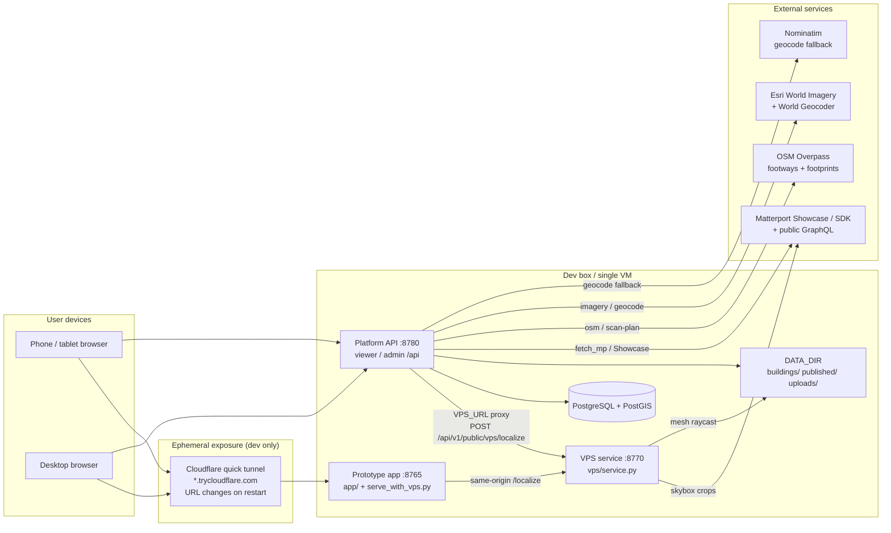

# Architecture - MetaDigi Labs / NavMe campus wayfinding

Thorough reference for engineers and agents picking up the codebase cold.
Facts below are from the code and docs under `/workspace/wayfinding/`; do not invent capabilities beyond them.
Companion docs: [DATA_FORMATS.md](DATA_FORMATS.md), [ONBOARDING_A_MATTERPAK.md](ONBOARDING_A_MATTERPAK.md), [DEPLOYMENT.md](DEPLOYMENT.md), [API.md](API.md), [ADMIN_GUIDE.md](ADMIN_GUIDE.md), [ROADMAP.md](ROADMAP.md). Project handoff: [`../../HANDOFF.md`](../../HANDOFF.md).

---

## 1. Goals and product scope

**Product:** low-cost, open-source indoor + outdoor wayfinding for campuses and multi-building sites scanned with Matterport. User experience is Google Maps-style: satellite/campus map → building → 2D/3D floor plans → search a room → turn-by-turn multi-floor directions (step-free aware), with visual positioning (VPS) and later native AR.

**Inputs per building**

| Input | Role |
|---|---|
| MatterPak (folder/zip with `model.obj` + `colorplan_*.jpg`) **or** ASTM `.e57` / Matterport `mp_e57_*.zip` | Mesh, colour plans (or synthetic plans from E57) |
| Matterport model ID (`m=` in Showcase URL) | Public GraphQL: floors, sweeps, rooms, labels, tags (still required for E57) |
| Address or lat/lon | Seed for imagery / georef |

**In scope today (built)**

- Onboarding pipeline `wfpipe` (MatterPak or E57 → georeferenced indoor maps + nav graph + POIs)
- Hybrid indoor/outdoor routing (Matterport sweep graph + doors/stairs + OSM footways)
- Admin dashboard (curate, publish, scan planning, i18n)
- Public viewer (ArcGIS Maps SDK JS; client-side A*; static-export capable)
- Scan planning (CAD/PDF → Pro3 grid → CSV/PDF)
- VPS prototype (`vps/`, hloc-style) with platform proxy slot; field page on the church prototype
- i18n first cut (en/es/fr/de/hi/kn/ar, Arabic RTL) via `branding.enabled_languages`

**Roadmap only (not built)** - WebXR AR overlay; native ARKit/ARCore tracking; multi-building outdoor routing between buildings; full IMDF export; MapLibre viewer port. See §13 and [ROADMAP.md](ROADMAP.md).

**Test site:** Shiloh Institutional Baptist Church, 2400 Greenland Ave, Charlotte NC; model `Hn36TwktGgz`. Venue slug `greenland-campus`, building slug `greenland`.

---

## 2. System context

| Port / URL | Process | Code |
|---|---|---|
| `:8765` | Church prototype static site; optional VPS same-origin proxy | `app/`, `app/serve_with_vps.py` |
| `:8780` | Platform: viewer `/`, admin `/admin/`, API `/api/*` | `platform/scripts/dev_server.sh` |
| `:8770` | VPS FastAPI `POST /localize` | `vps/service.py` |
| Docker `:80/:443` | Caddy → viewer, admin, `api:8000` | `platform/docker-compose.yml`, `deploy/caddy/Caddyfile` |

**Cloudflare tunnels are temporary.** The prototype is exposed with `cloudflared tunnel --url http://localhost:8765`; the `*.trycloudflare.com` URL changes on every restart and has no uptime guarantee. Production path is a real domain + Docker/Caddy (or static export). See [DEPLOYMENT.md](DEPLOYMENT.md).

---

## 3. Repository layout

Root: `/workspace/wayfinding/`

| Path | Role | Status |
|---|---|---|
| `app/` | Original church prototype viewer (ArcGIS JS) + hand-built `data/`; `localize.html` VPS field page; `serve_with_vps.py` | Frozen reference; do not break |
| `platform/` | Productized platform (git repo): API, pipeline, admin, viewer, deploy, docs, tests | v0.1 working natively |
| `platform/api/` | FastAPI `wayfinding_api` (JWT admin, jobs, publish, public read, VPS proxy, scan plans) | |
| `platform/pipeline/wfpipe/` | 16-step onboarding CLI | |
| `platform/admin/` | Vue 3 (CDN) + MapLibre SPA, no bundler (`admin.js`) | |
| `platform/viewer/` | Public viewer (`wf-boot.js` → `app.js` / `ui.js` / `routing.js`) | |
| `platform/var/data/` | Runtime data (git-ignored): `buildings/<slug>/{work,out}`, `published/<slug>/vN`, `uploads/`, `scan_plans/` | |
| `platform/locales/` | Shared i18n JSON + `i18n.js` (symlinked into admin/viewer) | |
| `platform/fixtures/` | Test-site pipeline config + cached OSM JSON | |
| `vps/` | Visual positioning prototype (owned by VPS workstream) | In progress |
| `matterpak/` | Input scans (MatterPak folder; future E57 under `matterpak/<slug>/`) | |
| `work/` | Prototype-era scratch | |
| `Campus_Wayfinding_Foundation.md` | Vision / design choices | |
| `FIELD_TEST_PLAN.md` | On-site VPS test procedure | |
| `HANDOFF.md` | Cold-start handoff | |

---

## 4. Onboarding pipeline (`wfpipe`)

Registry and order: `platform/pipeline/wfpipe/runner.py` (`STEPS`, `ORDER`). Each step is fingerprinted (selected config keys + dependency fingerprints + required outputs). Re-runs skip unchanged steps unless `--force` / `--from`.

### MatterPak zip/folder vs E57

| Path | What ingest does |
|---|---|
| MatterPak folder or `.zip` | Unzip/copy → find `model.obj` (or any `*.obj`), `colorplan_*.jpg`, textures → `work/matterpak/`, `matterpak_manifest.json` |
| Bare `.e57` or folder with one | `e57_convert.py`: `pye57` + Open3D → voxel downsample → `model.obj` + synthetic `colorplan_*.jpg`; manifest `source_format: "e57"` |
| Matterport `mp_e57_*.zip` | Extract `cloud_0.e57`, then same E57 path |

Matterport model ID is required in all cases (sweeps/nav from GraphQL, not from the cloud). E57 synthetic colour plans make auto-georef weaker; plan on control points or admin fine-tune. Optional knobs: `"e57": {"voxel_m", "colorplan_res_m", "max_points"}` in pipeline config. Extra: `.venv/bin/pip install 'wfpipe[e57]'` (+ `libegl1` on headless Linux).

Prefer a **server path** for multi-GB files over browser upload (`MAX_UPLOAD_MB` default 8192). See `platform/scripts/copy_e57_from_pc.md`.

### Steps (order)

| # | Step | Depends on | Key inputs | Outputs | What |
|---|---|---|---|---|---|
| 1 | `ingest` | – | `matterpak` path | `work/matterpak/model.obj`, manifest | Unzip/copy or E57→OBJ+plans |
| 2 | `fetch_mp` | – | `matterport_model_id` | `work/mp_model.json` | Public GraphQL: floors, sweeps+neighbours, rooms, labels, mattertags |
| 3 | `mesh` | ingest | OBJ | `work/mesh.npz` | Vectorised V, F |
| 4 | `colorplan` | mesh | mesh + plans | `work/colorplan_map.json` | Top-down render per floor; ECC align → plan-pixel↔model affine |
| 5 | `imagery` | fetch_mp | lat/lon | `work/sat.png`, `sat.json` | Esri World Imagery z20 tiles |
| 6 | `georef` | colorplan, imagery | `georef` mode | `out/georef.json`, preview jpg | `auto` NCC search; `control_points` LS similarity; `fixed` affine |
| 7 | `floors` | fetch_mp, mesh | optional overrides | `work/floors_resolved.json` | F1…Fn from MP floors (sweep height), z-bands |
| 8 | `overlays` | georef, floors, colorplan | | `out/floor_F*.webp`, `floors.json` | Plan images + corners |
| 9 | `glb` | georef, floors, colorplan | `glb` | `out/model_*.glb`, `model_glb.json` | Decimated, vertex-coloured, ENU |
| 10 | `voxel` | mesh | | `work/vox.npz` | Occupancy + floor-height grid |
| 11 | `osm` | georef | `osm` | `work/osm_*.json` | Overpass footways + footprints (mirrors/retries; or cached files) |
| 12 | `graph` | fetch_mp, voxel, georef, floors, osm | `stairs`, `graph` | `out/nav_graph.json`, `walkgrid.json` | Sweep graph prune, doors, stairs, OSM tie-in, step-free |
| 13 | `pois` | graph | `pois_seed`, `arrival_poi` | `out/pois.json` | Rooms, entrances, stairs, labels/tags, seeds |
| 14 | `indoor` | graph, pois, osm | | `out/indoor_F*.geojson`, `site_shell`, `buildings_osm` | IMDF-like units/walls/openings/anchors |
| 15 | `thumbs` | pois | `thumbs` | `out/thumbs/` | Sweep skybox thumbs for direction cards |
| 16 | `export` | indoor, overlays, glb, thumbs | name, address, branding… | `out/config.json` | Per-building viewer manifest |

Measured on test site (`Hn36TwktGgz`, 533k faces): full run ≈ 2.5 min on the box (georef ≈ 50 s, GLB ≈ 20 s).

### Publish

Admin/CLI `wayfinding publish <slug>` (`api/wayfinding_api/services/publish.py`):

1. Copy `DATA_DIR/buildings/<slug>/out/` → immutable `DATA_DIR/published/<slug>/vN/`
2. Rewrite `pois.json` from DB (published POIs only; locked admin edits preserved)
3. Patch `config.json` (names, floors, branding including `enabled_languages`, flags) and room names/anchors in `indoor_F*.geojson`
4. Insert/activate `map_versions` row (`is_current`)

Public API and static export only read the current version folder. Rollback = activate an older version.

CLI without DB: `wfpipe init` / `wfpipe run <workspace>` writes `out/` loadable via `WF_CONFIG.dataBase`.

---

## 5. Data model

### PostgreSQL / PostGIS (`platform/api/wayfinding_api/models.py`)

| Table | Purpose / key columns |
|---|---|
| `users` | `email`, `password_hash` (bcrypt), `is_admin` - CLI create only |
| `venues` | Campus grouping: `slug`, `name`, `branding` JSONB |
| `buildings` | `slug`, `venue_id`, address, lat/lon, `location` POINT(4326), `matterport_model_id`, `sdk_key_ref` (**env var name, never the key**), `matterpak_path`, `georef`, `pipeline_config`, `model_info`, `status`, `branding` |
| `floors` | `fid` (F1…), labels, ordinal, `elevation_m` / `height_m` (model z), `mp_floor_id` |
| `pois` | Stable `key`, category, floor, `geom` POINT(4326), model xyz, nearest sweep/node, step-free (NULL=auto), `locked`, `published`, `source` |
| `control_points` | model_xy ↔ lat/lon, residuals |
| `nav_graphs` | Latest draft graph JSONB + stats (A* in-process; pgRouting not used) |
| `map_versions` | `version`, `path`, `is_current`, notes |
| `jobs` | `kind`, params, status queued/running/succeeded/failed/cancelled, step, log |

Migrations: `api/alembic/versions/` (`wayfinding migrate`). Scan plans are file-backed under `DATA_DIR/scan_plans/{id}/meta.json`, not PostGIS.

### Key files (draft `out/` and published `vN/`)

| File | Role |
|---|---|
| `config.json` | Building manifest (`wayfinding.building/v1`) |
| `georef.json` | Affine model → EPSG:3857 + mode/residuals |
| `nav_graph.json` | Nodes (sweep/door/osm) + edges (length, stairs, step_free) |
| `walkgrid.json` | Raster walkability / floor z for path smoothing |
| `floors.json` + `floor_F*.webp` | Overlay images + corners |
| `pois.json` | `wayfinding.pois/v1` places |
| `indoor_F*.geojson` | IMDF-inspired units/walls/openings/anchors |
| `site_shell.geojson`, `buildings_osm.geojson` | Outline + neighbours |
| `model_*.glb` | ENU meshes |
| `thumbs/` | Direction-card skybox crops |
| Venue `manifest.json` | `wayfinding.venue/v1` list of published buildings |

Full schemas: [DATA_FORMATS.md](DATA_FORMATS.md).

### Coordinate frames

| Frame | Units / axes | Used by |
|---|---|---|
| **Model** | Matterport metres, right-handed, **Z up** | MatterPak OBJ, GraphQL sweeps/rooms, nav node xyz, POI `model` |
| **Plan pixel** | Colour-plan image px (per floor) | colorplan / overlays |
| **EPSG:3857** | Web Mercator metres | Georef affine target |
| **WGS84** | lon/lat degrees | GeoJSON, POI `lonlat`, DB geometries SRID 4326 |
| **glTF ENU** | +X east, +Y up, −Z north | Viewer 3D GLBs |

Transform: `georef.json.model_to_epsg3857_affine` is 2×3 **A**:

`[X, Y]_3857 = A[:, :2] · [x, y]_model + A[:, 2]`

Similarity (rotation θ, ground scale ≈ 1) including Mercator factor `1/cos(lat)`. Implementations that must stay identical: `pipeline/wfpipe/geo.py` (`Georef`), `api/.../services/navgraph.py` (`GeoT`), `admin/admin.js` (`Geo`), `viewer/app.js`.

Admin fine-tune: shift (m E/N) and rotate (deg CCW) about model centre → compose onto A → `mode: "fixed"` → rebuild downstream.

---

## 6. Routing

**Graph construction** (`pipeline/wfpipe/steps/graph.py`):

1. Matterport sweep nodes + neighbour edges from `fetch_mp`
2. Prune by length, walls, floor gaps, obstacles (voxel / walkability)
3. Split edges through doorways → door nodes / hubs
4. Stair zones: config `stairs` list **or** auto-detect steep sweep edges (≥ ~0.3 m rise per metre)
5. Tie OSM footway nodes within `graph.osm_link_max_m` (default 12 m)
6. Flag `step_free` on edges (`maxstep` ≤ `step_free_max_step_m`, default 0.16 m; stair edges are not step-free)

**Cost model** (in `nav_graph.json`): weight = 3D length (m); `stair_penalty_m` (default 15); walk speed 1.2 m/s; stair extra time per metre rise.

**Runtime**

| Where | Implementation |
|---|---|
| Viewer | Client-side A* (`viewer/routing.js`, ngraph.path) + Turf smoothing via walkgrid |
| Admin route tester / public route API | Server-side (`services/navgraph.py`) on draft or published graph |

Step-free mode drops edges with `step_free: false`. Test site has **no verified step-free entrance** in data, so parking → indoor step-free routes often return "no route".

**Tour interior:** route result includes `sweep_ids` (LOS/collinear-shortcut Matterport sweep ids for straighter Tour; `sweep_ids_raw` = full A*) and `nodes[]`. Map `smoothed` + turn-by-turn instructions use the same sweep/hard geometric path as Tour (path2). `viewer/mp_preview.js` / `MpPreview.open(route)` loads Showcase (+ SDK if key present) and `Sweep.moveTo` along those ids; FLY duration scales with hop length. Embed cannot place the camera on arbitrary mesh/walk-grid points. **Mesh tour** (Path B, admin `tour_modes.mesh_tour`) reuses AR Preview walk on published GLB; **Bundle Scene** scaffold (Path A) is Dollhouse-only free-cam per Matterport docs — see `docs/MESH_TOUR_OPTIONS.md`. Deep link `&ss=<index>` from sweep labels is coded but not fully verified.

---

## 7. Admin and viewer

### Admin (`platform/admin/`)

Vue 3 global build + MapLibre GL, single `admin.js` (no bundler). JWT via `POST /api/v1/auth/login`; token in `Authorization: Bearer` (and `?token=` for image URLs).

Pages: login, buildings list, add-building wizard (model lookup → details/geocode → MatterPak/E57 → job), overview (incl. **Enabled languages** → `branding.enabled_languages`), georef, floors, POIs, route tester, publish/versions, jobs (live logs), **scan planning** (`#/scan-plan`). Details: [ADMIN_GUIDE.md](ADMIN_GUIDE.md).

### Viewer boot (`platform/viewer/`)

1. `wf-config.js` sets `apiBase` (default `/api/v1/public/`), `venue`, optional `dataBase`
2. `wf-boot.js` loads venue `manifest.json` → picks building (`?b=` or first) → loads `config.json` → builds `window.WF` (`cfg`, `D(file)`, `others`)
3. Applies branding; inits i18n from `branding.enabled_languages` (en always on); builds floor pickers
4. `app.js` (map/layers/3D) + `ui.js` (search, place card, directions) + `routing.js`

Campus search indexes other buildings' `pois.json`; choosing one navigates to `?b=<slug>&to=<poi>`.

### i18n / RTL

- Dictionaries: `platform/locales/{en,es,fr,de,hi,kn,ar}.json` + `locales/i18n.js`
- Admin header switcher: full first-cut catalog
- Viewer drawer switcher: only enabled locales; `localStorage` key `wf_lang`
- Arabic sets `dir="rtl"`
- POI/room names and turn-by-turn instruction strings stay as authored (usually English)
- Changes to enabled languages require **re-publish** so public `config.json` updates

---

## 8. Scan planning

Before a Matterport capture: upload a floor drawing and get recommended Pro3 tripod positions.

| Stage | Mechanism |
|---|---|
| Upload | PNG/JPG/PDF/DXF → `DATA_DIR/scan_plans/{id}/` |
| Scale | Manual: draw scale line / px-per-m / DXF units |
| Address hint | Nominatim (Esri fallback) + Overpass building footprint → oriented L×W m as scale-length hint (`POST …/address`, `…/scale-hint`) |
| Auto scale | `POST …/auto-generate`: estimate `px_per_m` from floor `area_m2` + walkable pixels, or footprint × bbox (±10–20% vs measured line) |
| Walkable | Auto mask or drawn polygon |
| Grid | 1.5–3.0 m spacing (Pro3-ish default 2 m), wall clearance, optional LOS filter |
| Path | Nearest-neighbour + 2-opt walk order; timing (setup+capture, walk with tripod, overhead) |
| Export | CSV + PDF |

API: `routers/scan_plans.py`, `services/scan_plan.py`, `services/address_footprint.py`. Admin route `#/scan-plan`. Limits: single-floor drawings, no furniture model, outdoor not handled, DXF largest closed loops only, Overpass flaky, footprint is roof outline (not interior walls), no automatic polygon overlay on the drawing.

---

## 9. VPS (visual positioning)

**Service:** `/workspace/wayfinding/vps/` - FastAPI `service.py`, `POST /localize` on `:8770`. Method (hloc-style, CPU, open source):

1. Reference DB from Matterport skyboxes: 80 sweeps × crops → MegaLoc globals + SuperPoint descriptors; keypoints lifted to 3D by raycasting MatterPak mesh
2. Query: MegaLoc top-10 → SuperPoint + LightGlue → pycolmap PnP-RANSAC (FOV search if unknown)
3. Output: model xyz, floor, compass heading, WGS84 via georef, confidence / inliers

Details and offline eval tables: `vps/README.md`, `vps/RESULTS.md`.

**Integration**

| Path | Behaviour |
|---|---|
| Platform | Set `VPS_URL`; `POST /api/v1/public/vps/localize` forwards body (`routers/vps.py`); 501 if unset. Published `config.json` has `vps_enabled`. Viewer Directions **Locate me** → Use camera posts here when enabled (also prototype `/localize`). |
| Prototype | `app/serve_with_vps.py` on `:8765` same-origin proxies `/localize` and `/health` → `:8770` (needed for camera access through tunnels) |
| Field UI | `app/localize.html` - photo → localize → draw on plan → log JSON. Procedure: `FIELD_TEST_PLAN.md` |

**Church-model limitation:** the DB and georef are built for model `Hn36TwktGgz` only. Other buildings need their own skybox fetch + `build_db.py` + georef. Eval used Matterport-sourced photos (optimistic vs real phones). Reject confidence &lt; ~0.3. Failures: plain walls, outdoor lawn, tiny rooms, bad focal estimates.

---

## 10. Auth and secrets

| Secret / credential | Where | Rules |
|---|---|---|
| `JWT_SECRET` | `platform/.env` | HS256 admin tokens; ≥32 random bytes; never commit |
| Admin password | bcrypt in DB; `var/dev_admin_password` (mode 600) in dev | No self-signup; `wayfinding create-admin` |
| `MATTERPORT_SDK_KEY` | `.env` | Domain-whitelisted SDK application key. Returned only to authenticated admins (Showcase URL). Public bundles expose `sdk_key_configured: true/false` only |
| `buildings.sdk_key_ref` | DB | Env **var name** (default `MATTERPORT_SDK_KEY`), not the key value. API currently uses the global env key |
| `viewer/data/sdk_config.json` / `app/data/sdk_config.json` | Optional local JSON for prototype MpPreview | Do not commit real keys; never log key values |
| `DATABASE_URL` / `POSTGRES_PASSWORD` | `.env` | |
| `VPS_URL` | `.env` | Optional base URL for localize proxy |

Never print `.env`, SDK keys, or JWT secrets in logs, chat, or published bundles. Uploads: sanitised names, size-capped, zip members flattened (no path traversal).

---

## 11. Deployment

See [DEPLOYMENT.md](DEPLOYMENT.md). Summary:

| Option | Notes |
|---|---|
| **A. Docker single VM** | `docker compose`: `db` (PostGIS 16), `api` (migrate + uvicorn :8000), `worker` (`wayfinding worker`), `caddy` (TLS, `/` viewer, `/admin/`, `/api/*`, `/locales`). **Written but not executed on the build box (no Docker).** |
| **B. Native** | How it was tested: local PG+PostGIS, `scripts/dev_server.sh` → `:8780` with inline worker |
| **C. Static only** | `wayfinding export-static dist --viewer viewer` → Cloudflare Pages / GitHub Pages / etc. Client-side routing; no admin, no VPS proxy, no server route API |

Current tunnels (`cloudflared` → `:8765`) are **ephemeral** development exposure, not production.

Caddy: `deploy/caddy/Caddyfile` - gzip, HSTS, 2 GB request body for large MatterPak/E57 uploads. MatterPaks can be mounted read-only at `/matterpaks` in compose.

---

## 12. Known limitations

| Issue | Reality |
|---|---|
| Weak georef | Flat roofs, tree cover, new construction, or **E57 synthetic colour plans** → low NCC; use control points / fine-tune |
| OSM / Overpass flaky | SSL EOF / 504s from the box; use `osm.footways_file` / `buildings_file` or fixtures; scan-plan address tries several mirrors then falls back to manual scale |
| E57 large-file transfer | Multi-GB E57s: prefer server path. Agent **CopyToBox** from the Fortune Windows PC is capped (~100 MB tool limit) and can be flaky for huge clouds - copy via scp/OneDrive sync or chunked paths, not the agent bridge for multi-GB files (`scripts/copy_e57_from_pc.md`) |
| Fortune desktop bridge | Transfers and machine-targeted tools against the user's Fortune PC have been unreliable for large Matterport downloads; confirm file finished (not `.crdownload`) before copy |
| Stair autodetection noise | Auto mode finds real stairs **plus** extra candidate zones; review or set explicit `stairs` bboxes before trusting new buildings |
| No step-free entrance (test site) | Every detected entrance has steps → step-free from parking fails |
| Sparse outdoor OSM | Few footways; routes hug front walkway/porch |
| Sanctuary unscanned | Placeholder POI only; not routable through sanctuary volume |
| Docker untested | Compose/Dockerfile/Caddy syntax-checked only |
| Multi-building campus | Code exists; only one real published building exercised; no cross-building outdoor routing |
| ArcGIS JS dependency | Production basemaps need Esri terms/account; MapLibre port is roadmap |
| `MATTERPORT_SDK_KEY` unset on box | SDK auto-walk off; Showcase iframe still works |
| Matterport public GraphQL | Undocumented; could change (`steps/fetch_mp.py`) |
| Showcase `&ss=` deep link | Derived from sweep labels; not verified |

---

## 13. Open roadmap (honest)

From [ROADMAP.md](ROADMAP.md), in agreed order:

1. **VPS in platform viewer** - Locate me / Use camera → GPS snap or `/api/v1/public/vps/localize` (prototype `/localize`); harden confidence, heading on blue dot, FOV
2. **Field-test kit** - QR `?from=<poi>`, printable sheets, logging page (`FIELD_TEST_PLAN.md`)
3. **Native AR** - ARKit/ARCore (or AR Foundation): VIO between VPS fixes, re-anchoring, route snapping, AR arrows, floor-change detection. **WebXR** remains a later optional layer on the same data (foundation doc); not started
4. Multi-building outdoor routing via shared OSM into a venue graph
5. Full IMDF export + OSM indoor tagging
6. Accessibility polish (verified step-free, elevators/ramps, audio TBT)
7. Ops: object storage + CDN, metrics, error tracking

Also cut or partial in v0.1: nav-graph editor UI, per-building SDK keys (partial), Showcase inside public viewer, POI photo upload, running-job cancel, admin user-management UI, structured opening hours, CI Playwright, MapLibre viewer.

Shipped first cuts (2026-09-29): scan planning (+ address footprint + auto-generate), i18n, E57 ingest.

---

## Quick component to code map

| Concern | Primary paths |
|---|---|
| Pipeline steps | `platform/pipeline/wfpipe/steps/*.py`, `runner.py`, `e57_convert.py`, `geo.py` |
| API / auth / jobs | `platform/api/wayfinding_api/{routers,services,models,auth}.py` |
| Publish / workspace | `services/publish.py`, `services/workspace.py` |
| Scan plans | `routers/scan_plans.py`, `services/scan_plan.py`, `address_footprint.py` |
| Admin UI | `platform/admin/admin.js` |
| Viewer | `platform/viewer/{wf-config,wf-boot,app,ui,routing,mp_preview}.js` |
| i18n | `platform/locales/` |
| VPS | `vps/{service,localize,build_db,vpslib}.py` |
| Prototype | `app/`, `app/localize.html`, `app/serve_with_vps.py` |
| Deploy | `platform/docker-compose.yml`, `deploy/`, `scripts/` |
