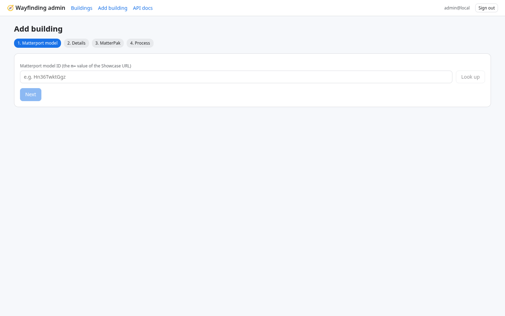
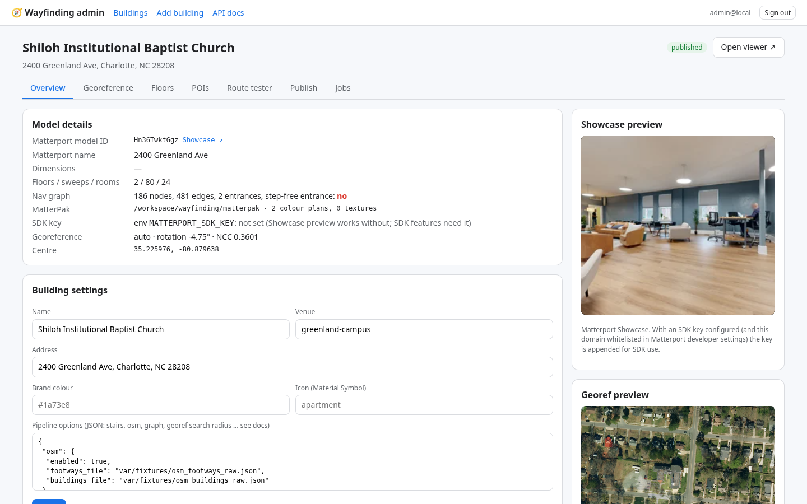
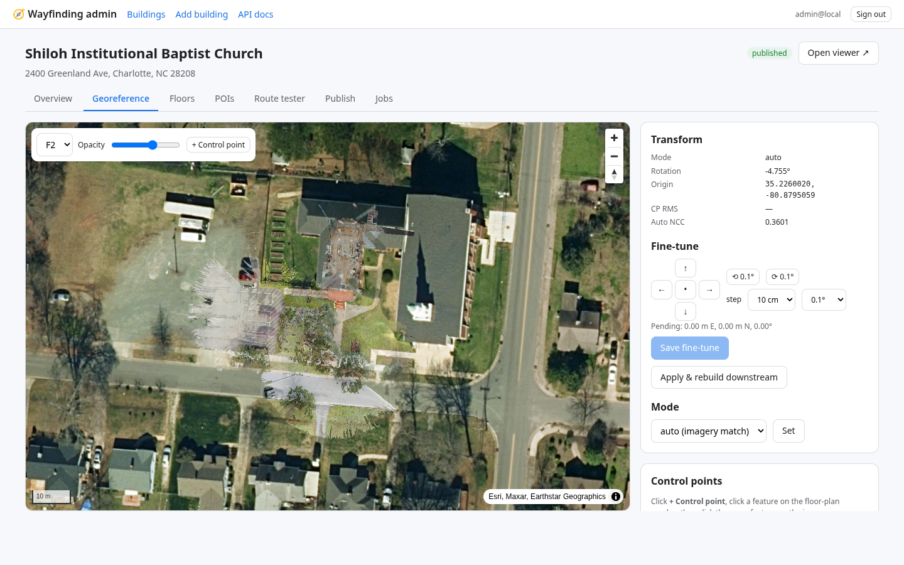
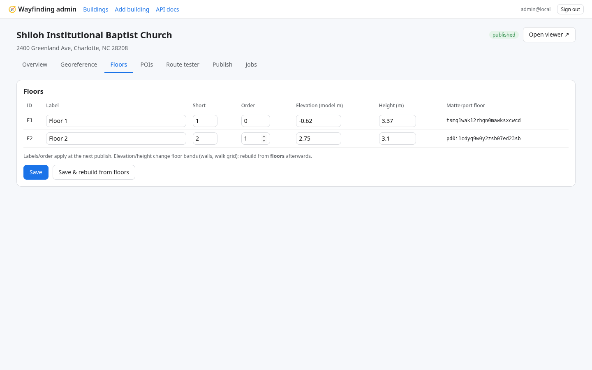
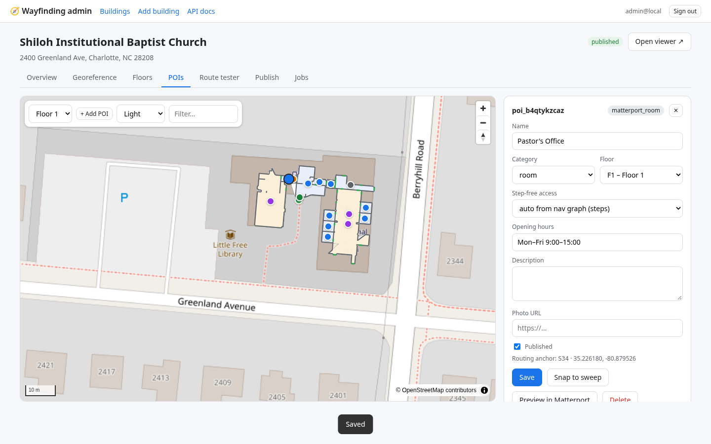
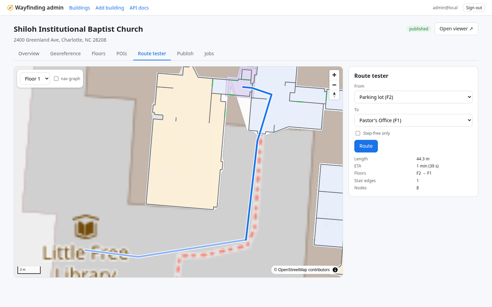
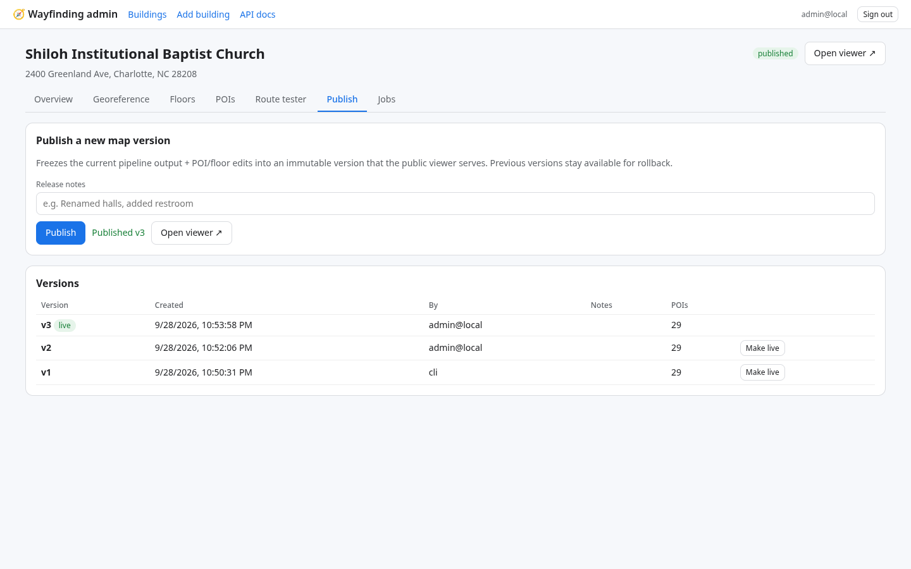
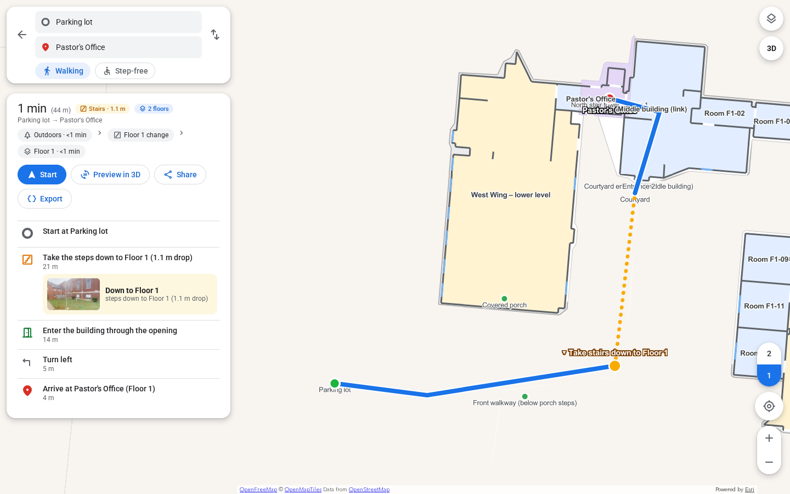

# Onboarding a MatterPak or E57

Goal: from a Matterport (or LiDAR) scan to a published, routable indoor map. Worked example = the test site
(Shiloh Institutional Baptist Church, 2400 Greenland Ave, Charlotte NC 28208, model `Hn36TwktGgz`).

## 0. What you need
| Input | Where it comes from | Required |
|---|---|---|
| Matterport **model ID** | the `m=` value of the Showcase URL (`https://my.matterport.com/show/?m=Hn36TwktGgz`) | yes (public GraphQL must be able to read the model: model must be public/unlisted). Still required for E57 sources — sweeps/nav come from the model, not the point cloud |
| **MatterPak** *or* **E57** | MatterPak zip/folder (`*.obj`…) **or** bare `.e57` **or** Matterport E57 export zip (`mp_e57_*.zip` → `cloud_0.e57`) | yes |
| **Address** or lat/lon | geocoded with Esri World Geocoder (default) or Nominatim | yes (seed for the imagery search) |
| Control points | 2+ features visible on both the floor plan and satellite imagery | only if auto georef fails (more likely with E57 synthetic colour plans) |
| Curated POI names | the building owner | recommended |

Upload limit is `MAX_UPLOAD_MB` (default **8 GB**). Browser upload of files **>2 GB often shows 100% then stalls** (client finished sending; server verify/timeout never returns). **Always use a server path** for multi-GB files:

1. Copy onto the box under `/workspace/wayfinding/matterpak/<slug>/` (zip or extracted `.e57`).
2. In **Add building → MatterPak or E57** (or building Overview → **MatterPak / E57 path**), click a known-path suggestion or paste the full path and **Use path**.
3. API: `POST /api/v1/admin/buildings/{slug}/matterpak/path` with `{"path":"..."}` (validates existence + format).

Example paths already on this box:
- `/workspace/wayfinding/matterpak/4926-Tacoma-Dr/cloud_0.e57` (~5.06 GB)
- `/workspace/wayfinding/matterpak/4926-Tacoma-Dr/mp_e57_4926-Tacoma-Dr_pAFsSSgF5kj.zip` (~3.75 GB)

Older note:

Upload limit is `MAX_UPLOAD_MB` (default **8 GB**). For multi-GB E57 / MatterPak files, **prefer a server path**:
copy onto the box (e.g. `/workspace/wayfinding/matterpak/<name>/site.e57`) and paste that path in the Add-building
wizard instead of uploading through the browser. Docker: `./matterpaks/` is mounted read-only at `/matterpaks`.

### E57 → MatterPak-like assets
When `matterpak` points at a `.e57` (or a folder containing one), the **ingest** step converts it with open-source
tools (`pye57` + `open3d`, optional extra: `.venv/bin/pip install 'wfpipe[e57]'`):

1. Read XYZ (+ RGB if present), voxel-downsample (~0.05–0.1 m)
2. Build `model.obj` (Open3D Poisson / Ball Pivoting, or a 2.5D heightfield fallback)
3. Render synthetic top-down `colorplan_000…N.jpg` (one per Z-band / floor cluster)
4. Write `matterpak_manifest.json` with `source_format: "e57"` and conversion params

Georef may need more admin help than a real MatterPak colour plan (synthetic rasters lack Matterport’s cleaned look).
Install note: Open3D on headless Linux needs `libegl1` (`apt install libegl1`).

## 1a. Using the admin dashboard
1. **Add building** → *1. Matterport model*: paste the model ID, **Look up** (shows name, floors, sweeps, rooms, Matterport geo-coordinates if set).
   
2. *2. Details*: slug (URL id, lowercase), name, address (**Geocode** fills lat/lon), venue (campus).
3. *3. MatterPak or E57*: upload a `.zip` or `.e57`, or type a server path (`/data/matterpaks/site.e57` or a folder).
4. *4. Process*: starts an onboarding job; the log streams live (≈2–3 min for a 500k-face model; E57 conversion adds time proportional to cloud size).
5. Open the building → **Overview**: check counts (floors/sweeps/rooms, nav nodes, entrances), the Showcase and georef previews.
   
6. **Georeference**: set the overlay opacity slider and compare walls with the roof/imagery. If off, nudge with the arrows/rotate buttons (10 cm / 0.1° steps) → **Save fine-tune** → **Apply & rebuild downstream**. Or add control points (+ Control point: click a feature on the plan, then the same feature on the imagery; ≥2 points; **Fit**) — residuals are shown per point.
   
7. **Floors**: rename (e.g. "Lower level", "Main floor"), set short labels, order, heights.
   
8. **POIs**: rename rooms, add missing places (**+ Add POI**, click the map), drag to move, set category, hours, photo, step-free override, **Snap to sweep**, CSV export/import.
   
9. **Route tester**: pick from/to, check the path, stairs count and ETA; toggle *Step-free only*.
   
10. **Publish** (versioned). The viewer (`/?b=<slug>`) now serves this version.
     

## 1b. Using the CLI (what the automated test does)
```bash
cd platform; set -a; . ./.env; set +a
.venv/bin/wayfinding add-building greenland --name "Shiloh Institutional Baptist Church" --model-id Hn36TwktGgz \
   --matterpak /workspace/wayfinding/matterpak --address "2400 Greenland Ave, Charlotte, NC 28208" \
   --venue greenland-campus --config fixtures/greenland_pipeline.json
.venv/bin/wayfinding onboard greenland --inline          # or without --inline: queued for `wayfinding worker`
.venv/bin/wayfinding import-pois greenland names.csv      # optional, CSV format in DATA_FORMATS.md
.venv/bin/wayfinding publish greenland --notes "first publish"
```
E57 example (server path after copy-to-box):
```bash
.venv/bin/wayfinding add-building my-site --name "…" --model-id <MatterportId> \
   --matterpak /workspace/wayfinding/matterpak/my-site/scan.e57 --address "…"
# or PATCH matterpak_path in admin / API to that path, then onboard
```
Re-run only part of the pipeline: `wayfinding onboard greenland --from graph` or `--steps georef,overlays --force`.

The pipeline can also run without the API/DB (pure files):
```bash
.venv/bin/wfpipe init ws/greenland --name "…" --model-id Hn36TwktGgz --matterpak ../matterpak --address "…"
.venv/bin/wfpipe run ws/greenland            # all steps; skips up-to-date ones
.venv/bin/wfpipe status ws/greenland
.venv/bin/wfpipe steps                       # list steps + descriptions
```
`ws/greenland/out/` is then directly loadable by the viewer (`WF_CONFIG.dataBase = ".../out/"`).

## 2. Results on the test site (vs the hand-built prototype `app/data`)
| Check | Prototype | Platform pipeline |
|---|---|---|
| Georef rotation | −4.955° | −4.755° (auto) |
| Georef position difference | – | 0.06 m at model origin, 0.09–0.16 m at ±30 m |
| Nav graph | 184 nodes / 480 edges (80 sweeps, 78 OSM, 26 doors) | 186 / 481 (80, 80, 26) |
| Floors | F1, F2 | F1 (z −0.62), F2 (z 2.75) |
| POIs | 26 (11 room, 4 hall, 4 outdoor, 2 corridor, 2 entrance, 2 stairs, 1 parking) | 29 with the fixture seeds (same + 2 auto door entrances + 1 extra stair POI); 20 without seeds |
| Auto stair detection (no `stairs` config) | manual zones | finds the north stair tower and the porch steps, plus 2 extra candidate zones (review!) |

## 3. Troubleshooting
| Symptom | Fix |
|---|---|
| `fetch_mp` fails / 401 | model must be public or unlisted; the pipeline uses the public GraphQL endpoint `https://my.matterport.com/api/mp/models/graph` (no key). Retries are built in. |
| Overpass errors/timeouts (osm step) | non-fatal (graph built without outdoor paths). Retry later or set `osm.footways_file` / `osm.buildings_file` to cached Overpass JSON. |
| Low auto NCC (< 0.25) or visibly rotated overlay | use fine-tune or control points; tree cover / flat roofs / new construction confuse matching. Increase `georef.search_radius_m` if the address geocodes far from the building. E57 synthetic colour plans often need control points. |
| Floors wrong (e.g. mezzanine merged) | override in pipeline options: `"floors":[{"id":"F2","elevation":…,"height":…}]`, then rebuild from `floors`. |
| Stairs missing / phantom stairs | set explicit `"stairs":[{"id","name","bbox_model":[x0,y0,x1,y1],"floors":["F1","F2"]}]` (model metres; read coordinates from the admin POI map's model readout or `nav_graph.json`). |
| No step-free route | expected when every entrance has steps; mark a verified step-free entrance POI with *step-free: yes* and/or add graph edges (not yet editable in UI – see ROADMAP). |
| GLB grey/untextured | textures are not required; vertex colours come from colour plans. |
| E57 ingest: `pye57` / `open3d` import error | `.venv/bin/pip install pye57 open3d` and `sudo apt install libegl1`. Upload/path is still accepted; ingest fails with this message until deps are present. |
| Browser upload times out on multi-GB E57 | copy file to the server (see `scripts/copy_e57_from_pc.md`) and use the server-path field. |
